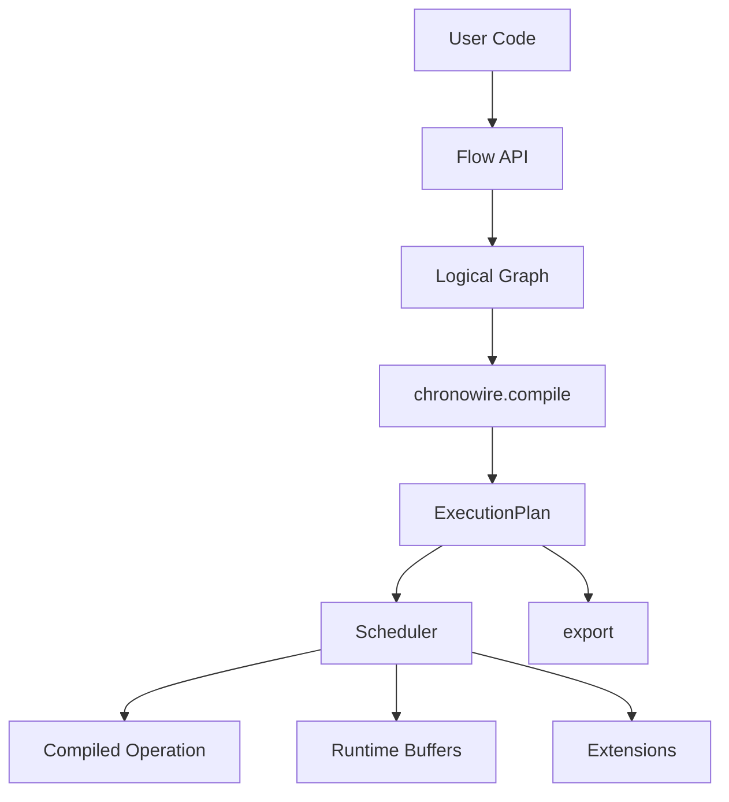

# Chronowire 基本設計

## 1. 目的

Chronowire は、サンプル列、フレーム列、イベント列、状態更新列を含むストリーミング処理を、Python 上で簡潔に記述し、実行可能な計算計画へ変換するフレームワークである。

主な対象領域は次のとおり。

- 音響・海洋音響信号処理
- アレイ信号処理
- センサストリーム処理
- オンライン推定
- 複数レート処理
- 複数経路の同期処理
- Python 試作から C++ 製品実装への移行

Chronowire が解決する中心課題は、個々の信号処理アルゴリズムではなく、それらを接続したときに発生する次の問題である。

- 分岐後の処理順序
- 合流時の時間同期
- 異なるフレーム長や更新周期の共存
- 履歴バッファの管理
- 共通前段の二重実行回避
- 複数終端の一括実行
- 実装言語やBackendの切り替え
- 実行前のグラフ検証と最適化

## 2. 設計原則

### 2.0 独立した明示コンパイル型フレームワーク

Chronowireはspflowの後継や互換レイヤではない。Chainerからはスコープ付き設定など一部のAPI設計を参考にするが、実行モデルは異なる。ChronowireはDefine-by-Runではなく、FlowでLogical Graphを構築してから明示的にcompileする。

### 2.1 Flow はデータではない

Flow は値のラッパーではなく、計算グラフ上の一つの出力Portを指すハンドルである。

概念上、Flow が保持する情報は次だけである。

```text
Flow
 ├ Graphへの参照
 ├ output Port ID
 └ 不変Config scopeへの参照
```

Flow 自身は以下を保持しない。

- 実行中データ
- FIFOバッファ
- Scheduler状態
- Kernelの作業領域
- 実行結果
- 可変runtime状態

### 2.2 構築時に実行しない

```python
y = x.map(f).frame(size=1024).map(g)
```

この時点では `f`、`frame`、`g` は実行されない。Node、Port、Edgeが内部Graphへ登録されるだけである。

実行は必ず次の順序を取る。

```text
Flow APIによるGraph構築
        ↓
chronowire.compile(outputs)
        ↓
ExecutionPlan
        ↓
ExecutionPlan.run()
```

### 2.3 Graph設計をユーザーへ露出しすぎない

ユーザーは通常、Flowを変数として保持し、処理をつなぐだけでよい。

初期公開APIには次を含めない。

- `branch()`
- `join()`
- `.named()`
- Nodeを直接生成するAPI
- Edgeを直接接続するAPI
- Schedulerを直接操作するAPI

Graph内部ではNode ID、Edge ID、Port IDを用いるが、通常のユーザーコードはそれらを知らなくてよい。

### 2.4 分岐はFlowの再利用で表す

```python
base = source.map(preprocess)
beam = base.map(beamform)
covariance = base.map(estimate_covariance)
```

同一Portから複数Edgeが伸びるだけであり、Branch Nodeは不要である。

### 2.5 合流はFlow引数で表す

```python
output = signal.map(
    combine,
    reference=reference_flow,
)
```

Flow引数は同期入力Edgeへ変換される。

- 通常値: 定数パラメータ
- Flow: 同期入力Edge
- StateFlow: 最新状態参照

時刻とともに変化する設定値、別経路から渡される制御値、Kernelが更新する状態をConfig経由で運ばない。それらはFlowまたはStateFlowとして明示的なEdgeに変換し、データ移動をGraphへ記録する。

### 2.6 スコープ付きConfigを使用する

Configは不変であり、Flow chainは現在のConfig scopeを参照する。子scopeは親scopeを変更せず、明示的な属性パス単位で値を上書きする。

```python
base = cw.Config(system={"fs": 32768})
beam_config = base.scope(
    beamformer={"bearing_deg": 20.0},
)
beam = source.with_config(beam_config).map(beamform)
```

compile時には各Nodeが宣言したConfig pathと解決値をPlanへ記録する。Configはデータ輸送路、Kernel状態、診断格納先として使わない。

### 2.7 compile対象を明示する

```python
plan = chronowire.compile([
    beam,
    covariance,
])
```

指定されたFlowを観測終端とし、それらへ至る祖先Nodeの和集合だけをExecutionPlanへ含める。

途中Flowも指定できる。

```python
plan = chronowire.compile([
    chronowire.output(preprocessed, collector=chronowire.Latest()),
    chronowire.output(beam, collector=chronowire.Bounded(max_items=64)),
])
```

この場合、`preprocessed`は途中観測出力として最新値が結果に含まれ、その後段の`beam`経路も実行される。

### 2.8 全出力を暗黙に保持しない

compile対象は観測終端を定めるが、全値のメモリ保持を意味しない。値の保持は`Latest`、`Bounded`、`Sink`などのcollectorで明示する。Extensionはcollectorと独立して途中Portや終端Portを観測できる。

### 2.9 安全な劣化結果を値として残す

数値的に十分な条件を満たさなくても、安全なfallbackを生成できる場合は処理を停止しない。Kernelは値とともに`OK`、`DEGRADED`、`INVALID`のstatusおよびDiagnosticを出力できる。

- `DEGRADED`: fallbackや不十分な積分など、利用制約付きだが観測可能な値
- `INVALID`: 値を利用できないが、区間・原因・入力統計を記録できる結果
- 例外: メモリ破壊の恐れ、契約違反、Graph不変条件違反など安全に継続できない場合

collectorとExtensionはstatusを失わず、劣化理由と論理時間区間を保存する。

### 2.10 DSPアルゴリズムを含めない

責務境界は次のとおり。

```text
Chronowire
    Graph、論理時間、同期、Scheduler、compile、Runtime

DSP Operation package
    FFT、FIR、Beamformer、Covariance、MVDR等

SceneRenderer
    信号・音場生成

evaluations
    シナリオ、指標、可視化、レポート
```

公開Operationと実装言語の分離、Python first/C++ firstの開発経路は
[14_Operation設計.md](14_Operation設計.md)を正本とする。v0.4までの`Kernel`は実装上の先行名称であり、
Flow利用者へCompiledKernel、ABI、Sessionを露出する公開設計にはしない。

Chronowire coreからDSP固有パッケージをimportしてはならない。

## 3. 非目標

初期バージョンでは次を目標としない。

- 分散処理
- ネットワーク透過処理
- 永続メッセージキュー
- Exactly-once分散保証
- 自動微分
- ニューラルネット学習
- GUIグラフエディタ
- 汎用ETL
- DSPアルゴリズム集

## 4. 全体構成



## 5. 主要オブジェクト

| オブジェクト | 責務 |
|---|---|
| Flow | Graph上の出力Portを指す公開ハンドル |
| Config | Flow chainが参照する不変なスコープ付き設定 |
| Graph | 論理Node、Port、Edgeの保持 |
| Kernel | 処理アルゴリズムのcompile契約 |
| CompiledKernel | 実行可能な処理単位 |
| ExecutionPlan | compile後の不変な実行計画 |
| Scheduler | Node起動・同期・バッファ消費 |
| Source | 論理時間区間に対する入力供給 |
| Extension | ログ、Profiler、Snapshotなどの横断機能 |
| OutputSpec | 観測終端とcollector policyの組 |
| Emission | 値、論理時間、status、Diagnosticを持つ出力単位 |
| GraphInfo | Graphの読み取り専用スナップショット |

## 6. 分岐・複数終端

分岐した経路は合流しなくてもよい。

```text
                 ┌─ beam
source ─ base ───┼─ covariance
                 └─ diagnostic
```

次の指定により3経路を同列の出力として扱う。

```python
plan = chronowire.compile([
    chronowire.output(beam, collector=chronowire.Latest()),
    chronowire.output(covariance, collector=chronowire.Bounded(max_items=64)),
    diagnostic,
])
```

- 共通前段は一回だけ実行する
- 各終端は異なるrateを持てる
- 各終端は異なるcollector policyを持てる
- 各終端は異なる型を返せる
- OutputResultの順序はcompile引数順に対応する

## 7. PythonからC++への移行性

ChronowireはPython APIを入口とするが、GraphとExecutionPlanの中心表現は言語非依存に近づける。

- 整数ID
- 明示的Port
- 連続配列に変換可能なPlan表現
- logical timeの整数表現
- Kernel compile/run分離
- Backend境界
- JSONまたは独自IRによるserialize

最終的には、Pythonで構築したGraphとほぼ同一のPlanをC++ runtimeで実行できることを目標とする。
